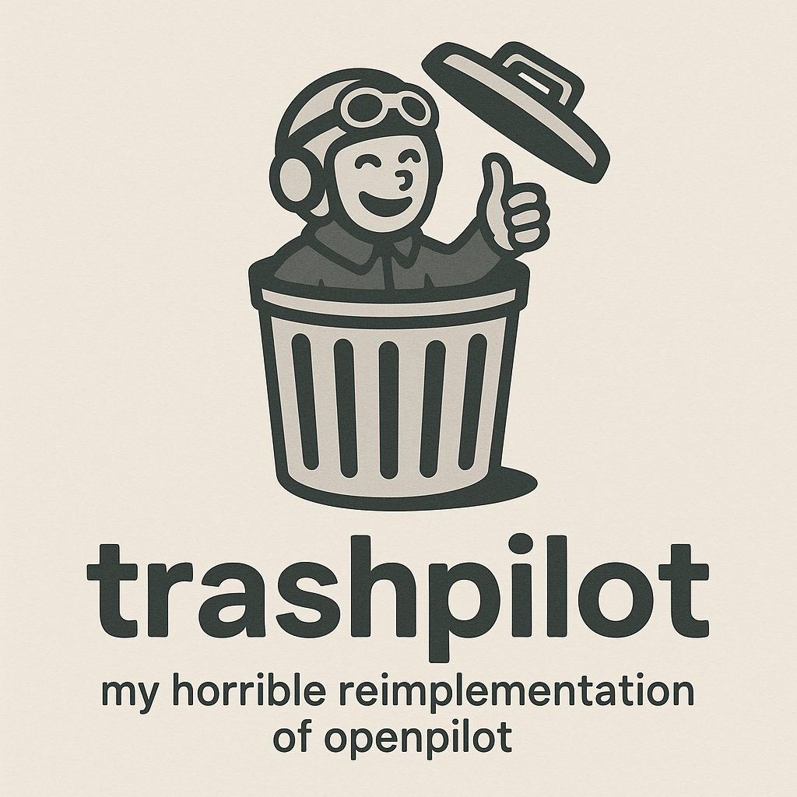
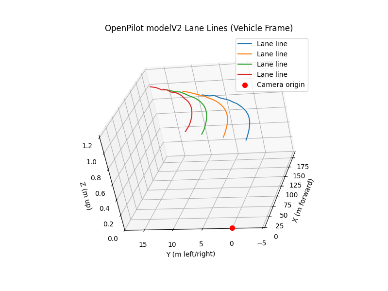

<p align="center">
  
</p>

# TrashPilot
*its total garbage*  
https://discord.com/invite/9tB23GRDye
This is an experimental repository designed to be vastly simpler than openpilots. It exists to document my knowledge of openpilot's codebase. Inside you will find tools to test and replicate various snippets of openpilot. Features currently included are webcam capture and sharing architecture, model inference etc.

## Setup
```
git clone --recursive https://github.com/1971chevycamaro/trashPilot.git
```  
VScode should prompt you regarding setup of python environment, <u>but if not</u>, you must
make a virtual environment and `pip install -r requirements.txt` (if i keep it updated)   

for files dependent on the openpilot repo:
```git clone --recursive https://github.com/you/trashPilot.git
cd external/openpilot
git fetch --tags       # updates the list of releases
git checkout 5e3fc13751dc9b9c5d5e0991a17c672eda8bd122 # checkout a specific release cuz the models always change
git lfs install
git lfs pull
cd ../..
```
## Usage
edit `webcam_server_robust.py` to your approprivate dev/video*
and explore the results with any of the `webcam_*.py` files!  
observe your pretty face

`viewfinder.py` interactively shows the effect of a homography matrix on a provided image (may be buggy)  
`viewfinder2.py` displays the focus region of a homography matrix on a provided image then shows the result in a new window.  
the calculations performed in `viewfinder*.py` are used in openpilot's model input pipeline.  
`display_*.py` visualizes outputs from other applications. im very fond of `display_steering2.py`

`visualization_lanes.py` shows how openpilot's model output is converted to lane lines in 3D space.
## Real Car Usage
TrashPilot isn’t just a simulator—it runs on an actual car setup.  
Here’s the current hardware stack used for testing:

- **CAN bus bridge:**  
  An Arduino with an **MCP2515 CAN controller** exposes the vehicle’s CAN traffic over serial.  
  This is bridged to Linux’s native **SocketCAN** interface via `slcand`, making the car appear as `can0` for direct access in Python.  
  This allows live decoding of messages like steering torque, wheel speed, and throttle position.

- **Actuator:**  
  The steering wheel is driven by a **3D-printed actuator** using a **hobby-grade 550 brushed DC motor** and gear reduction system.  
  The actuator receives torque commands derived from TrashPilot’s model outputs, allowing for physical feedback testing and control tuning.

- **Camera input:**  
  A standard **iPhone** running a webcam app is used as the forward camera source.  
  It’s exposed to Linux as a virtual `/dev/video*` device, feeding real-time frames into the same preprocessing and homography pipeline used in simulation.

This setup forms a complete **hardware-in-the-loop** testing environment, combining real vehicle data and physical actuation with the model inference pipeline.  
It’s used to validate lane-line projection, curvature estimation, and torque feedback logic under real-world conditions.

> ⚠️ **Note:** This system is strictly for experimentation in a controlled environment.  
> It is not intended for use on public roads or as an autonomous driving system.
<p align="center">
  
  
</p>
> Inspired by the ok work at [comma.ai’s openpilot](https://github.com/commaai/openpilot).
