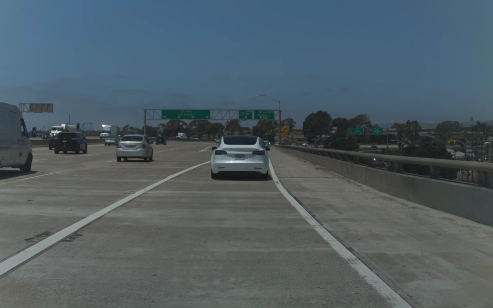

# VisionIPC and Model Inputs Overview

`visionipc.png` is a sample image showing the **VisionIPC client** from **openpilot**.  
Use it as a reference when making your edits!

---

### `img*.png`
The files named `img*.png` represent the **parsed RGB raw inputs** to the openpilot model.  
> ⚠️ Note: The *actual* model inputs are in a special **YV12 format**, not RGB.
